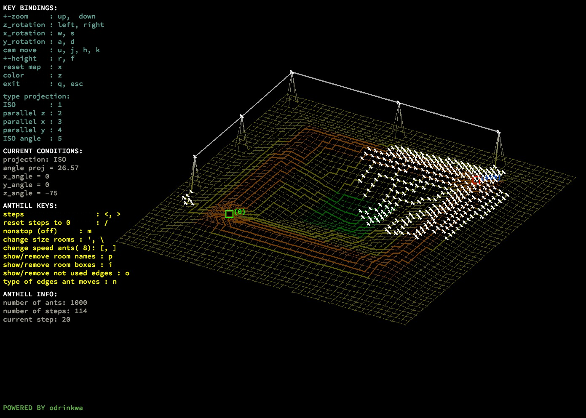
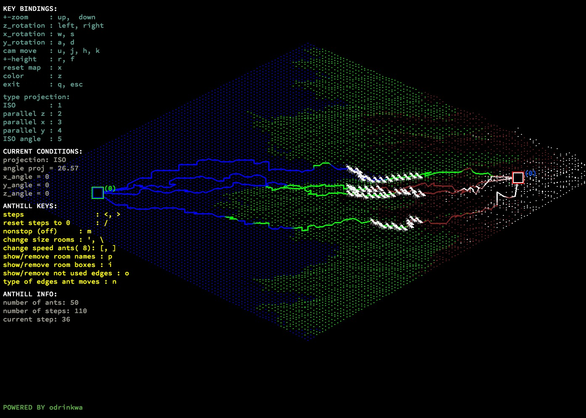

# lem-in
#### lem-in - search max flow in anthill





for compile: ```make```

---

run lemin: ```./lem-in < file_anthill```

visualization: ```./lem-in < file_anthill | ./visu```

---
script on python3 for converting map fdf to lemin:

```python3 convert_fdf_to_lemin file_fdf```

this script create file in lem-in format.

---
script on python3 for running any other lem-in:

```python3 ./run_lemin lem-in_program_name file_anthill```

This script do:
> 1. convert map in arguments to map, where rooms have only 2 coordinates: x, y. (often students do lem-in, that get only two coordinates of room, and drop error in other case)
> 2. run lem-in_program_name (in argument 1), and calculate ways.
> 3. run visualization on primary map, with calculated ways.
---
---

some interesing maps in folder: ```/maps_lemin_some_interesting/```

example to run:


```python3 run_lemin.py ./lem-in ./maps_lemin_some_interesting/pylone_1000_10_10_35_35_3_z_remake```

or another realization of lem-in:

```python3 run_lemin.py ./lemin_other_students/lem-in_mtri_2212_1740 ./maps_lemin_some_interesting/pylone_1000_10_10_35_35_3_z_remake```

```python3 run_lemin.py ./lemin_other_students/lem-in_smight ./maps_lemin_some_interesting/pylone_1000_10_10_35_35_3_z_remake```